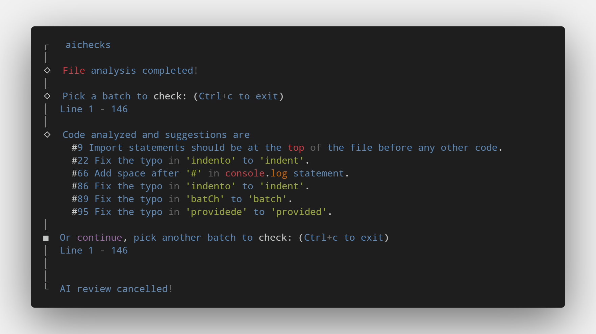

<div align="center">
  <div>
    
    <h1 align="center">AI Checks</h1>
  </div>
	<p>A CLI that helps you to identify potential bugs in your code and suggest changes for better code quality.</p>
	<a href="https://www.npmjs.com/package/aichecks"></a>
</div>

---

## Setup


1. Install _aichecks_:

    ```sh
    npm install -g aichecks
    ```

2. Retrieve your API key from [OpenAI](https://platform.openai.com/account/api-keys)


3. Set the key:

    ```sh
    aichecks config set OPENAI_API_KEY=<your token>
    ```


### Upgrading

First check for the installed version using:
```
aichecks --version
```

If it's not the latest version, run:
```sh
npm update -g aichecks
```

## Usage
### CLI mode

Call `aichecks <file path>` to generate suggestion for a specific file:

```sh
aichecks /src/index.js
```

### Options
#### OPENAI_KEY

Required

The OpenAI API key. You can get it from [OpenAI API Keys page](https://platform.openai.com/account/api-keys).